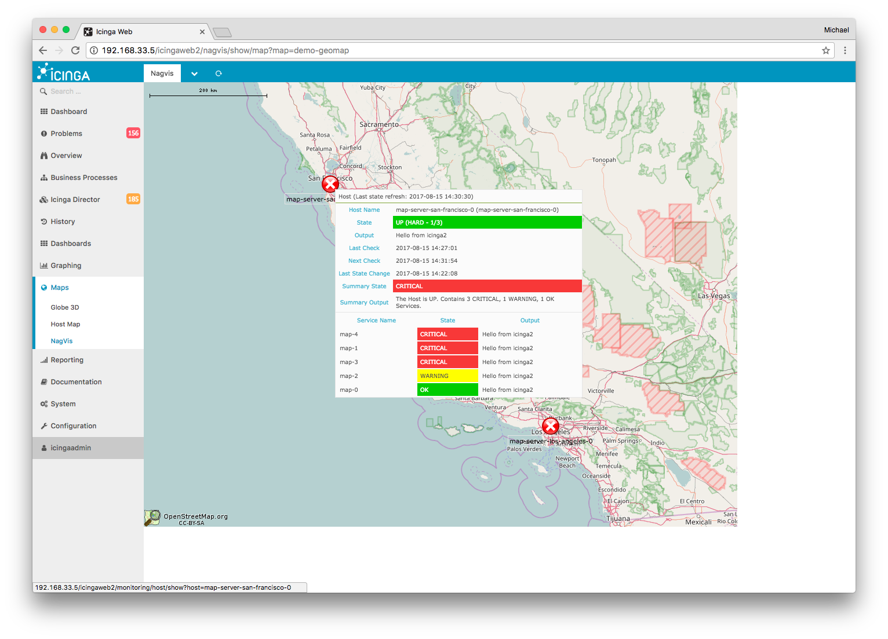
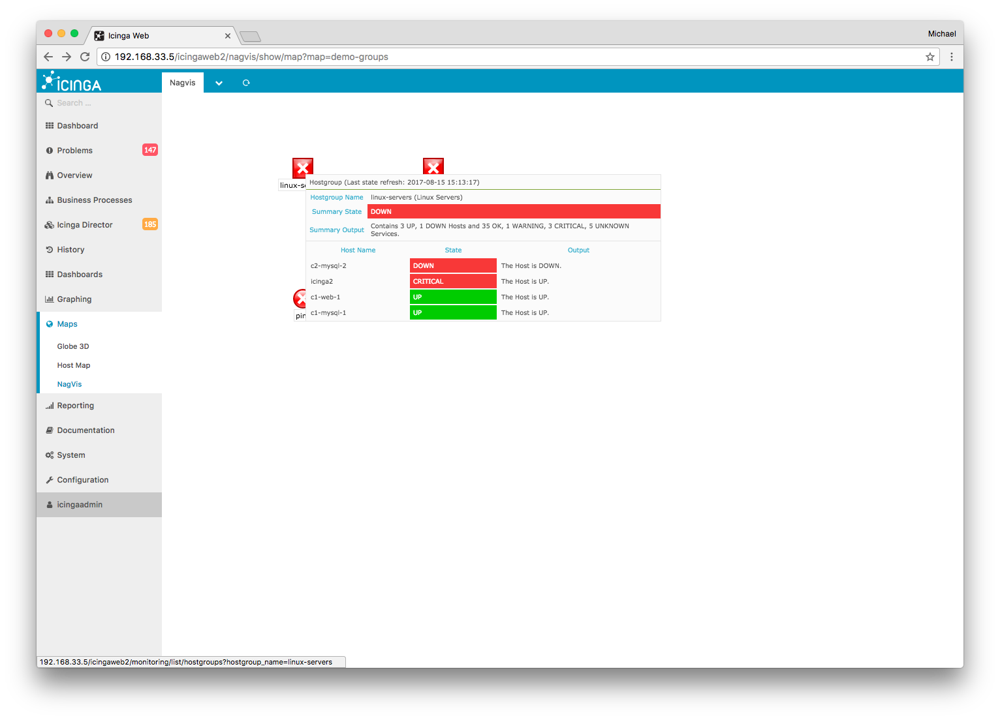

# About

This module integrates [NagVis](https://www.nagvis.org/) into [Icinga Web 2](https://www.icinga.com/products/icinga-web-2/)
and allows you to create beautiful maps for your datacenter, geolocation based maps or dynamic maps with parent-child
relations.

## License

Icinga Web 2 and this Icinga Web 2 module are licensed under the terms of the GNU
General Public License Version 2, you will find a copy of this license in the
COPYING file included in the source package.
